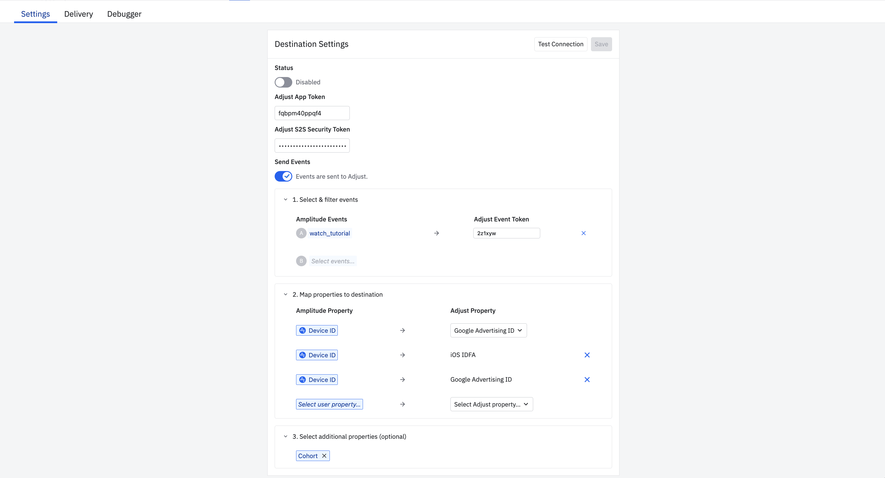

Amplitude CDP's Adjust streaming integration enables you to forward your Amplitude events to [Adjust](https://www.adjust.com/) with just a few clicks.

!!!beta "This feature is in Beta"

    This feature is in Beta and is in active development. Contact the Amplitude support team at [integrations@amplitude.com](mailto:integrations@amplitude.com) for access or support.

## About Adjust

[Adjust](https://www.adjust.com/) is a business intelligence platform for mobile app marketers, combining attribution for advertising sources with advanced analytics and store statistics.

## Setup

### Prerequisites

To configure an Event Streaming integration from Amplitude to Adjust, you need the following information from Adjust:

- **Adjust App Token:** Find the App token on the Adjust dashboard. For more information, see Adjust's article, [Server-to-server events](https://help.adjust.com/en/article/server-to-server-events).
- **Adjust S2S Security Token:** To start sending data into Adjust, you have to get your Adjust S2S Security Token. See the [Adjust documentation](https://help.adjust.com/en/article/server-to-server-s2s-security) for more help.

### Create a new sync

1. In Amplitude Data, click **Catalog** and select the **Destinations** tab.
2. In the Event Streaming section, click **Adjust**.
3. Enter a sync name, then click **Create Sync**.
4. Enter the **Adjust App Token** from Adjust.
5. Enter the **Adjust S2S Security Token** from Adjust.

### Configure event forwarding

In the **Send Events** section of the Adjust destination config, enable the **Events are sent to Adjust** toggle. This toggle ensures that Amplitude forwards events to Adjust. Amplitude forwards events to Adjust as it receives them, not on a schedule or on demand.

1. In the**Select and filter events** section, choose the events to send to Adjust. This integration doesn't support transformed events.

    - To map an event, select the Amplitude event, and enter the corresponding Adjust event token.

2. In the **Map properties to destination** section, select which Amplitude user properties map to which Adjust user properties.

    - Select an Amplitude user property that corresponds to your Adjust ID, from the left dropdown.
    - (Recommended) Map an Amplitude user property to Adjust **User ID**.
    - It's recommended that you map Amplitude properties to as many of the Adjust IDs (iOS IDFA, Google Advertising ID, Amazon Fire Advertising ID, Huawei Open Advertising ID, Adjust Device ID (ADID), IDFA, Android ID).

3. (optional) In the **Select additional properties**, select any more event and user properties to send to Adjust. 

#### Track Revenue events

To track Revenue events, map the following parameters:

- **revenue**: Revenue event value in full currency units. Minimum 0.001.
- **currency**: Revenue event [currency code](https://help.adjust.com/resources/lists/supported-currencies).
- **environment**: Environment to post the data to (**sandbox** or **production**). If this parameter is not included, it will post to **production**.

### Enable sync

When satisfied with your configuration, at the top of the page toggle the Status to "Enabled" and click Save.

## Example configuration setup

